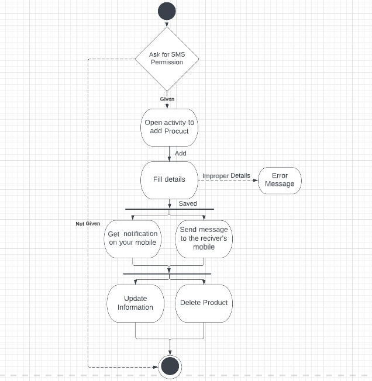
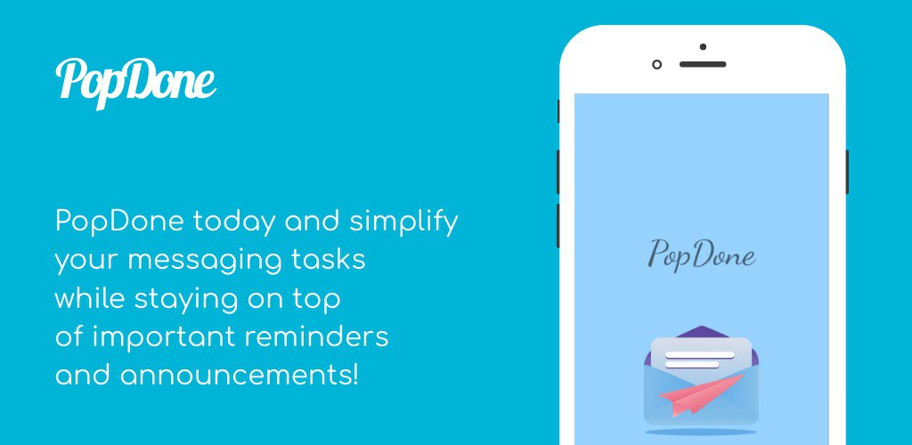
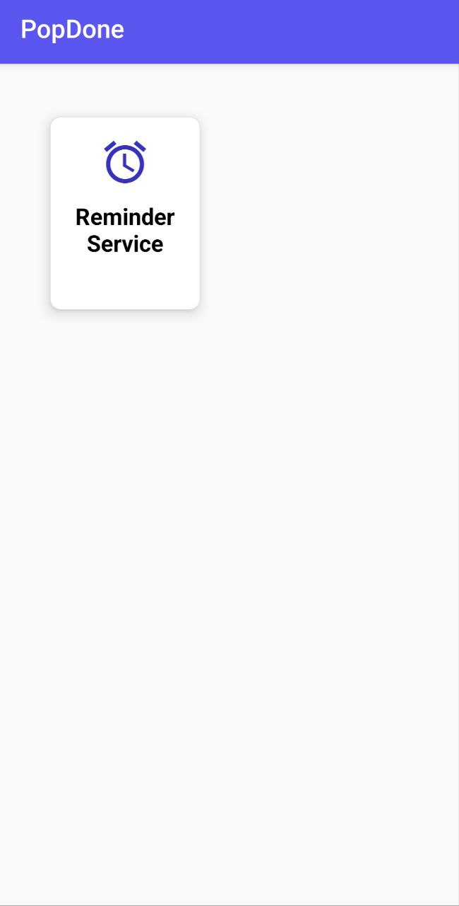
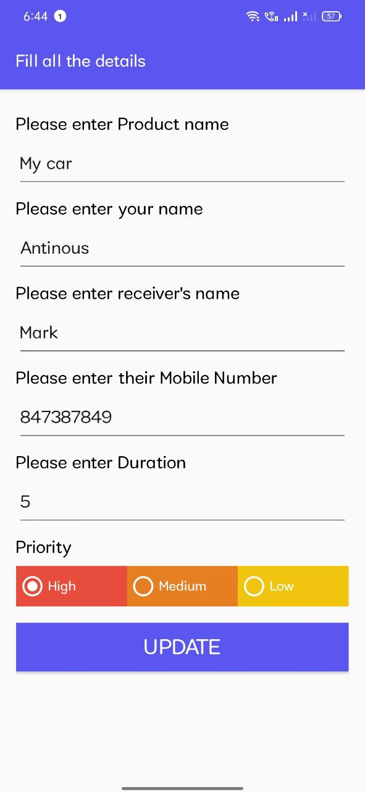
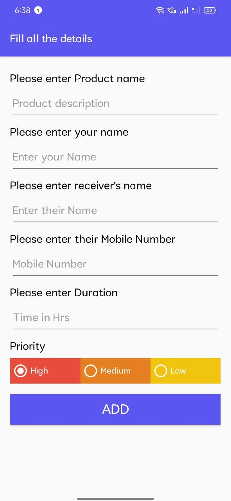
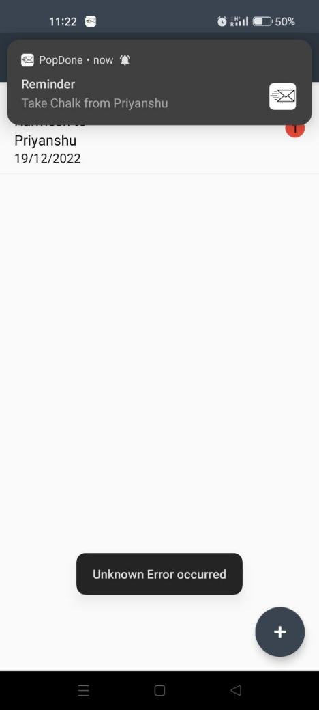
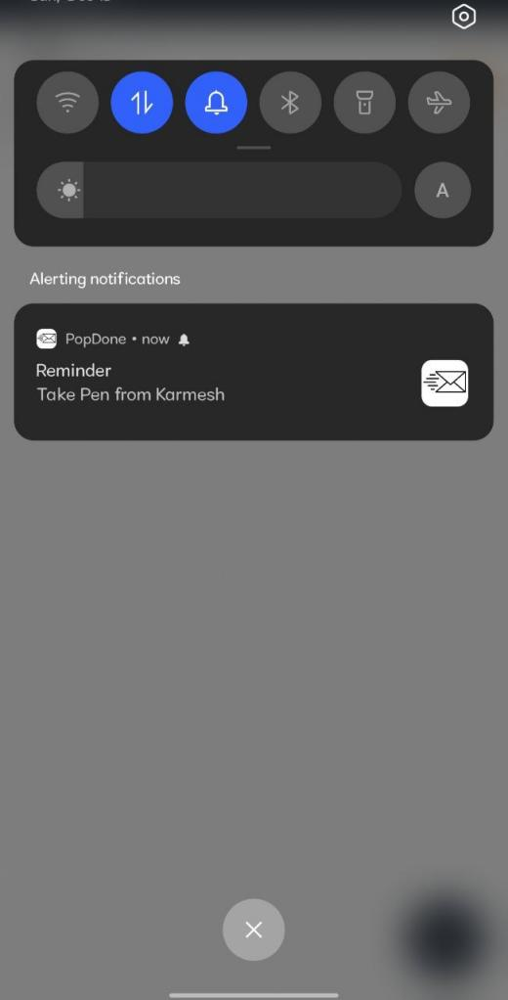

# Pop Done App:

PopDone is an offline application that allows user to store details of an object that we are lending other people and notify them after a certain time interval to return it, we can store details of the person who is lending the object and also the person who is taking it then we will take time as an input and after that time interval we can send a notification to the user in order to remind it.

• User able to manage list of the objects which we have given to other person.

• User able to send SMS to person who is lending object in order to remind it to return it back.
 
• User able to enter description of the item,its name,other person name who its taking object,its phone number.

• User able to delete the object from the list if it has been return back to the user.

• User able to get a reminder from the application that it have to take the object back from the person who is taking its object.

 Some characteristics of the application is listed below:

1.Views:

• User to see the number of item he has given to the person along with the description,date,and name of the other person who is taking the object.

2.Sent SMS:

• User able to send sms automatically to person who is taking object after a particular duration of time which it have entered in the input while lending to other person.

3.Notifications:

• User should be notified after a particular timestamp ,that is given in the input while adding the information.

Flow Of Application:

 
 
  POSSIBLE TEST CASES WITH SNAPSHOTS

• Correct information entered. output should be successful and able to send sms to other person who is taking object.

• Incorrect information entered. output should be unsuccessful and not able to send sms to other person who is taking object.

• Valid phone number is provided and user has proper network connection with enough sms plan service. output should be successful.

OPERATING ENVIRONMENT
-----------

The hardware, software and technology used should have following specifications:

• Ability to connect to the mobile network.

• Ability to exchange data over the network.

• Touch screen for convenience or Keypad (in case touchpad not available)

• Processor with speed of 500 MHz

• Continuous power supply

• Ability to use messaging service of mobile

• Ability to take input from user

• Device must have 512MB RAM or above

• Functional on android only.

DESIGN AND IMPLEMENTATION CONSTRAINTS
-----------

• Install Application and accept SMS send permission from the application.

• In case of network not available • If not able to exchange data over network, prompt
error message "Unknown Error Occured”

• In case of not able to access services of mobile hardware
if eg: Messaging service is not working, prompt error message, "Can’t access Messaging service".

ASSUMPTIONS AND DEPENDENCIES
-----------

• Network and data availability

• Power supply

• Better connection for exchanging data over network

• Availability of mobile services

